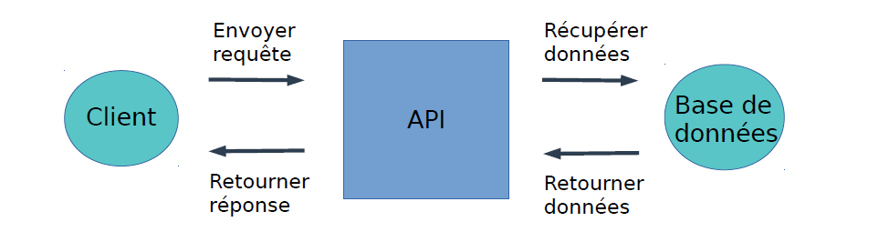
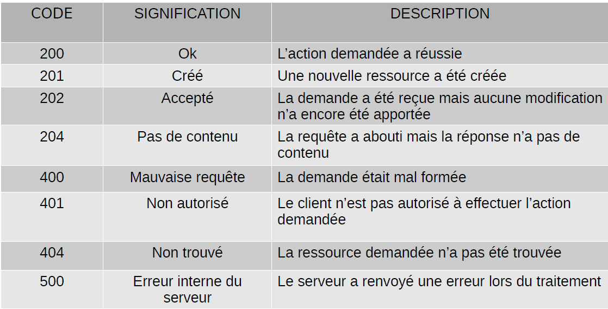
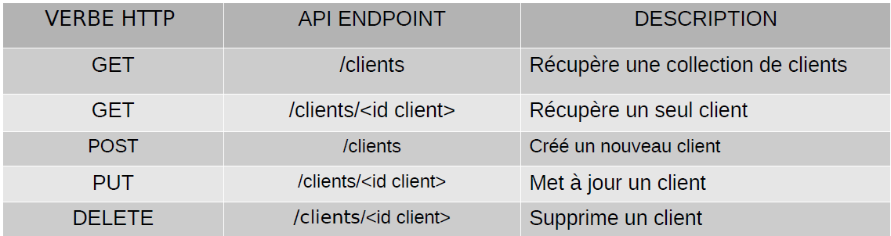

<!--
#header: Technologie Logiciel
footer: Technologies Logicielles | :e-mail: sebastien.morais@proton.me
-->

<style>
  @keyframes point-up {
    from { background-position: 50px 50px; }
    to { background-position: 50px 70px; }
  }
  @keyframes point-down {
    from { background-position: left 50px bottom 50px; }
    to { background-position: left 50px bottom 70px; }
  }
  section {
    animation: 0.5s ease-in-out alternate infinite point-up;
    #background: #fff url('https://icongr.am/feather/arrow-up.svg?color=0288d1') no-repeat 50px 50px / 80px;
    font-size: 30px;
  }
  section::before {
    content: '';
    display: block;
    position: absolute;
    top: 0;
    left: 0;
    right: 0;
    bottom: 0;
    pointer-events: none;
    animation: 0.5s ease-in-out alternate infinite point-down;
    #background: transparent url('https://icongr.am/feather/arrow-down.svg?color=0288d1') no-repeat left 50px bottom 50px / 80px;
  }
  @media (prefers-reduced-motion) {
    section, section::before {
      animation: none;
    }
  }

.hljs-string {
  color: #cba9a0 !important;
}
</style>

# Rappel et correction TD Docker

</br>
- Docker, Dockerfile, Docker-compose
</br>

</br>
- Correction TD
</br>

---

# Rappel API

Contexte communication client – serveur
- le client formule une requête pour avoir une information
- le serveur envoie une réponse contenant les données demandées (si
possible)

API : facilite l’interaction entre deux applications différentes afin qu’elles
puissent communiquer entres elles



---

# Service Web

Beaucoup de services Web (e.g. YouTube, GitHub, …) rendent leurs données accessibles à des applications tierces via une API

Objectif de ce CM : introduction aux API REST

REST : Representational State Transfer
- style d’architecture logiciel qui définit un modèle pour les communications client–serveur sur réseau
- ensemble de contraintes sur l’architecture logiciel promouvant la simplicité, l'évolutivité, les performances et la fiabilité

---

# Architecture REST

REST définit les contraintes suivantes :

- Sans état : le serveur ne conserve aucun état entre les demandes du client
  - le serveur n’a jamais à connaître l’état du client (et réciproquement)
  - le client maintient l’état de l’application de son point de vue
  - le serveur fait de même en maintenant l’état de ses ressources
:thought_balloon: Les états de sont jamais partagés !

- Client – serveur : Le client et le serveur doivent être découplés l'un de l'autre
:thought_balloon: Chacun peut se développer indépendamment !

---

# Architecture REST

REST définit les contraintes suivantes :

- Cache : les données extraites du serveur doivent pouvoir être mises en
cache (par le client ou par des serveurs intermédiaires)
:thought_balloon: Certains appels son fréquent

- Interface uniforme : le serveur fourni une interface uniforme pour
accéder aux ressources sans imposer de contraintes sur la manière dont ces ressources sont représentées ou manipulées

---

# Architecture REST

- Système en couche : le client peut accéder indirectement aux ressources du serveur via d'autres couches, e.g. cache, équilibreur de charge, serveurs proxy, ...
:thought_balloon: Peuvent apporter des fonctionnalités supplémentaires, e.g. cache, sécurité, transformation des données, ...

- Code à la demande (optionnel) : le serveur peut transférer du code au
client, e.g. scripts ou applets
:thought_balloon: Permet au serveur de fournir des fonctionnalités dynamiques ou des extensions spécifiques au client à la demande 

---

# Service Web REST

Un service Web REST est un service Web qui respecte les contraintes de
l'architecture REST
:thought_balloon: Exposition des données au travers d'une API

API REST : accès aux données du service Web via des URL Web publiques
:thought_balloon: Exemple d'URL de l'API REST de GitHub https://api.github.com/users/username

:question: Que permet cet URL ?

:thought_balloon: On accède aux données d’une API REST en envoyant une requête HTTP à un URL spécifique et en traitant la réponse

---

# API REST – Verbes HTTP

Une API REST traite les verbes HTTP !
:thought_balloon: Permet de savoir quelles opérations effectuer sur les **ressources** du service Web

Ressource : toute donnée disponible dans le service Web pouvant être manipulée et consultée avec des requêtes HTTP à l’API REST

Détaillons les verbes HTTP les plus utilisées avec les API REST

:question: Quels sont-ils et qu'est ce qu'ils sont sensés réaliser ?

---

# API REST – Verbes HTTP 

- GET : utilisé pour la récupération d’une ressource existante
  - traitement sans effet (read-only)
  - peut être mis dans le cache

Exemple : liste les objets d’une collection, la taille de la collection, récupère un objet et ses méta-données, ...

`curl -X 'GET' "https://api.github.com/users/SMoraisAnsys" -H 'accept: application/json'`

Si vous n’avez pas curl installez le OU utilisez https://reqbin.com/curl

---

# API REST – Verbes HTTP 

- POST : utilisé pour la création d’une nouvelle ressource
  - des informations sur la ressource à créer peuvent être données en paramètre de requête
  - n’est pas mis dans le cache (usuellement) 
  - n’est pas utilisé pour récupérer de l’information

- PUT : utilisé pour la mise à jour d’une ressource existante
  - sensé être idempotent (même résulat que le premier appel)
  - n’est pas mis dans le cache (usuellement)
  - n’est pas utilisé pour récupérer de l’information

Exemple : remplace toute une collection par une autre, remplace un objet existant ou le crée, ...

---

# APIT REST - Verbes HTTP

- DELETE : supprime la ressource
  - ne pas utiliser pour autre chose que la suppression de ressource
  - n’est pas mis dans le cache (usuellement)

Exemple : supprime un objet ou une collection

- PATCH : met à jour partiellement une ressource existante

Exemple : modification d’un objet

---

# Code d’état

Une fois qu’une API REST a reçu et traitée une requête HTTP, elle renvoie une réponse HTTP. Les principaux composants d'une réponse HTTP sont:
  - code de status : succés ou erreur
  - en-têtes de réponse : métadonnées comme le type de contenu, la date, les informations sur le serveur, les directives de cache
  - corps de réponse : données réelles envoyées par le server 

:thought_balloon: L’application peut exploiter le code de status afin de :
- gérer l’erreur rencontrée
- afficher un message de réussite
- ...

---

# Code d'états



---

# Points de terminaisons (Endpoints)

Une API REST expose un ensemble d’URL publiques qu’une application cliente utilise pour accéder aux ressource d’un service Web. Dans le contexte d'un API, ces URLs sont appelés des points de terminaisons (endpoints)

Exemple: système CRM (gestion relation client) où la base de l’URL a été retirée



:thought_balloon: En pratique, utilisation de l’URL complet (https://mon.api.com/clients)

---

# REST et Python (GET)

Pour écrire un code qui interagit avec une API REST, il est possible d’utiliser la paquet `request` (`pip install request`)

Testons ce paquet avec le service JSONPlaceholder https://jsonplaceholder.typicode.com/

```python
import requests

API_URL = "https://jsonplaceholder.typicode.com/todos/12"

reponse = requests.get(API_URL)

print(response.json())
print(response.status_code)
print(response.headers["Content-Type"])
```

---

# REST et Python (POST)

```python
import requests

API_URL = "https://jsonplaceholder.typicode.com/todos"
ACTION = {
  "userID": 12,
  "title": "Reviser TECHNOLOG",
  "completed": False,
}

response = requests.post(API_URL, json=ACTION)
print(response.json())
print(response.status_code)
print(response.headers["Content-Type"])
```

---

# REST et Python (PUT)

```python
import requests

API_URL = "https://jsonplaceholder.typicode.com/todos/42"
ACTION = {
  "userID": 42,
  "title": "Reviser TECHNOLOG, C'EST IMPORTANT",
  "completed": False,
}

response = requests.put(API_URL, json=ACTION)
print(response.json())
print(response.status_code)
```

---

# REST et Python (DELETE)

```python
import requests

API_URL = "https://jsonplaceholder.typicode.com/todos/12"

response = requests.delete(API_URL)
print(response.json())
print(response.status_code)
```

---

# REST et Python (PATCH)

```python
import requests

API_URL = "https://jsonplaceholder.typicode.com/todos/12"
ACTION = {
  "title": "REVISER ENCORE ET ENCORE !",
}
reponse = requests.patch(API_URL, json=ACTION)

print(response.json())
print(response.status_code)
```

---

# REST et Python – Création d’API

Lors de la création d’une API REST, il est important de :
1. Identifier les ressources (noms au pluriel)
2. Définir correctement vos terminaisons
:warning: Pas de verbe, juste des noms au pluriel
:thought_balloon: Dans le cas d’une ressource imbriquée, vous pouvez :
  - Utiliser des endpoints imbriqués sous des ressources (GET /commerce/12/clients)
  - Utiliser des chaînes de requête (GET /clients?commerce_id=12)
3. Choisissez votre format d’échange de données (JSON, XML)
4. Définissez vos réponses (code d’état, header, …)

Il existe des frameworks qui éliminent la complexité du traitement des requêtes HTTP et du retour des réponses (`Flask`, `Django`, `FastApi`)

---

# FastAPI et Uvicorn

- FastAPI : framework Web Python optimisé pour la création d’API et basé sur
  - `pydantic` : validation des données avec les annotations de type au runtime
  - `starlette` : framework de construction de services asynchrones

- Uvicorn : implémentation de serveur ASGI
ASGI (Asynchronous Server Gateway Interface) : fourni une interface standard entre les serveurs Web Python compatible asynchrone, les frameworks et les applications

:thought_balloon: Deux outils souvent réunis pour des applications et microservices modernes

---

# Première API

Un fichier FastAPI classique ressemble à cela (appelons le hello.py)

```python
# FastAPI est une classe fournissant les fonctionallités nécessaire à votre API
from fastapi import FastAPI

# Création d'une instance FastAPI: point d'interaction principal pour créer votre API
app = FastAPI()

# Decorateur d'operation sur l'endpoint "/"
# Indique à FastAPI que la fonction ci-dessous est en charge de gérer les
# requêtes associées à l'endpoint "/" en utilisant une opération get
@app.get("/")
async def root():
  return {"message": "Hello world"} 
```
:warning: Ce code ne s'exécutera pas directement avec Python, il faut un serveur

---

# Exécution l'API

- Installez les paquets `fastapi` et `uvicorn`

- Lancez votre application sur un serveur Uvicorn

```shell
uvicorn hello:app --reload
```

Connectez vous à l'adresse http://127.0.0.1:8000
Documentation http://127.0.0.1:8000/docs
Documentation alternative http://127.0.0.1:8000/redoc

Exercice: lancez votre application via Docker en écoutant sur le port 8888 (n'utilisez pas l'option `--reload` dans le Dockerfile)

---

# Paramètre de chemin

Il est possible de déclarer des paramètres de chemin

```python
from fastapi import FastAPI

app = FastAPI()

@app.get("/items/{item_id}")
async def read_item(item_id: int):
  return {"item_id": item_id}
```

Déclaration avec la même syntaxe que celle des strings Python formatés
Allez à l’adresse http://127.0.0.1:8000/items/12
:thought_balloon: Le type du paramètre est testé (http://127.0.0.1:8000/items/douze)

---

# Paramètre de requête

Paramètres ne faisant pas parti des paramètres de chemin
:thought_balloon: Ensemble de paires clef-valeur placés après `?` dans un URL
et séparés par des `&`

```python
from fastapi import FastAPI

app = FastAPI()

@app.get("/items/")
async def read_item(item_id: int, factor: int = 1):
  return {"item_id": item_id * factor}
```

URL : http://127.0.0.1:8000/items/?item_id=10&factor=5

---

# Multiple chemins et paramètres

FastAPI permet la déclaration de multiples chemins et paramètres

```python
from fastapi import FastAPI

app = FastAPI()

@app.get("/users/{user_id}/items/{item_id})
async def read_user_item(user_id: int, item_id: str, verbose: bool = False):
  item = {"item_id": item_id, "owner_id": user_id}
  if verbose:
    item["description"] = "Ceci est une description verbeuse"
  return item
```

---

# Modèles Pydantic

Définition de schéma que l’on souhaite recevoir

```python
from typing import Optional
from fastapi import FastAPI
from pydantic import BaseModel

class Item(BaseModel):
  name: str
  price: float
  description: Optional[str] = None
  store_id: int

app = FastAPI()

@app.post("/items/")
async def create_item(item: Item):
  return item
```

Testez votre API avec request (aide disponible http://localhost:8000/docs)

---

# Pierre Feuille Ciseaux

Exercice : codez une API du jeu Pierre Feuille Ciseaux

Rappel :
- 3 signes possibles (pierre, feuille ou ciseaux)
- 3 issues possibles (victoire, défaite ou égalité)

:thought_balloon: Pydantic supporte le type Enum

---

```python
from enum import Enum
from random import choice
from fastapi import FastAPI
from fastapi.responses import RedirectResponse

app = FastAPI()

class Hand(str, Enum):
  ROCK = "rock"
  PAPER = "paper"
  SCISSORS = "scissors"

class Result(str, Enum):
  WIN = "win"
  LOSE = "lose"
  DRAW = "draw"

@app.get("/", response_class=RedirectResponse)
async def home() -> str:
  return "/docs"

@app.post("/play", response_class=Result)
async def play(hand: Hand) -> Result:
  return choice(list(Result))
```