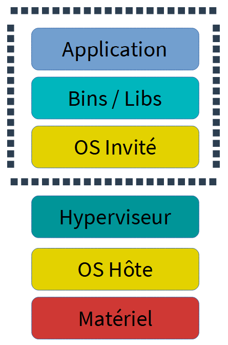
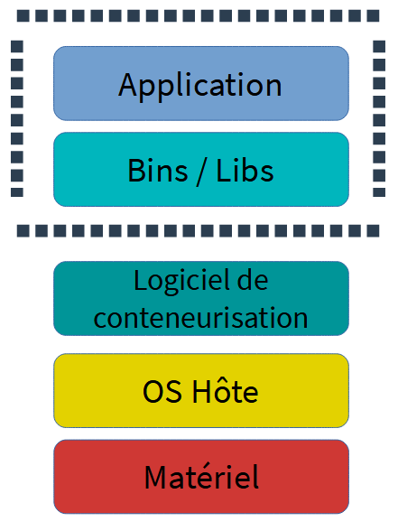
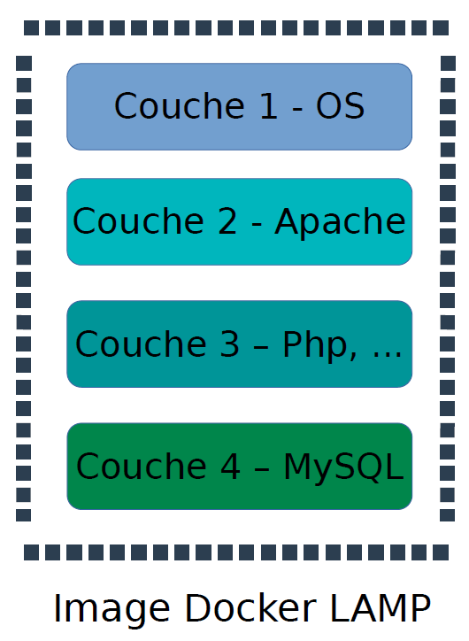

<!--
#header: Technologie Logiciel
footer: Technologies Logicielles | :e-mail: sebastien.morais@proton.me
-->

<style>
  @keyframes point-up {
    from { background-position: 50px 50px; }
    to { background-position: 50px 70px; }
  }
  @keyframes point-down {
    from { background-position: left 50px bottom 50px; }
    to { background-position: left 50px bottom 70px; }
  }
  section {
    animation: 0.5s ease-in-out alternate infinite point-up;
    #background: #fff url('https://icongr.am/feather/arrow-up.svg?color=0288d1') no-repeat 50px 50px / 80px;
    font-size: 30px;
  }
  section::before {
    content: '';
    display: block;
    position: absolute;
    top: 0;
    left: 0;
    right: 0;
    bottom: 0;
    pointer-events: none;
    animation: 0.5s ease-in-out alternate infinite point-down;
    #background: transparent url('https://icongr.am/feather/arrow-down.svg?color=0288d1') no-repeat left 50px bottom 50px / 80px;
  }
  @media (prefers-reduced-motion) {
    section, section::before {
      animation: none;
    }
  }
</style>

# Rappel et correction TD Test & CI

- Test boîte blanche, test boîte noire, test unitaire
</br>

- Framework de test: `unittest`, `pytest`
</br>

- Techniques : `patch`, `mock`, ...
</br>

- CI : Github actions

---

# Introduction à Docker

- Plateforme lancée en 2013

- Que permet Docker ? Comment ?

---

# Introduction à Docker

- Plateforme lancée en 2013

- Que permet Docker ? Comment ?

  - Développer, déployer et exécuter des applications avec des conteneurs
  - Embarque l'application avec toutes ses dépendances dans un processus isolé (i.e. conteneur)
  :thought_balloon: le conteneur est exécutable sur n'importe quelle machine et OS compatible avec le moteur Docker

A votre avis, pourquoi Docker est devenu populaire ?

---

# La virtualisation

La popularité de Docker provient des avantages des conteneurs sur la virtualisation. **Qu'est ce que la virtualisation ?**

- Fonctionnement simple :

  - mutualisation de plusieurs serveurs virtuels sur un serveur physique

  - (au lieu de) un serveur avec un OS faisant tourner une ou plusieurs applications

- Repose sur un hyperviseur :

  - logiciel permettant d'émuler les ressources matérielles d'un serveur physique (CPU, RAM, carte réseau, …)

  - permet aux machines virtuels (VM) de partager ces ressources

---

# La virtualisation - Avantages

<div class="columns70">
<div>

- Possède son propre système d'exploitation (et applications)
- Totalement isolée du système hôte
- Permet d'optimiser l'utilisation des ressources physiques à la demande

Exemple : machine avec 4 disques et 256 GO de RAM
:thought_balloon: 4 VMs indépendantes avec 1 disque et 64 GO de RAM et un OS différent

</div>
<div>



</div>
</div>

---

# La virtualisation - Inconvénients

<div class="columns70">
<div>

- Les ressources de la VM sont réservées

- Une VM met du temps à démarrer

- Baisse des performances à cause de la couche d'abstraction matérielle

- La couche OS Invité consomme beaucoup de ressource

</div>
<div>


</div>
</div>

---

# Conteneurisation

<div class="columns70">
<div>

La conteneurisation est une  *"virtualisation légère"*

- les ressources ne sont pas virtualisées

- isolation des processus au niveau de l'OS Hôte

- partage des ressources du système hôte

</div>
<div>



</div>
</div>

---

# Conteneurisation - Avantages

<div class="columns70">
<div>

- portabilité : un conteneur crée un package exécutables qui est extrait de l'OS Hôte (n'est pas lié et ne dépend pas de celui-ci)
- flexible : des applications complexes peuvent être conteneurisées
- vitesse : exploitent et partagent le noyau hôte
- réservation : ne réserve que les ressources nécessaires
- autonomie : réduction des différences entre la production et les développeurs 

</div>
<div>


</div>
</div>

---

# Conteneurisation - Avantages sur une VM

<div class="columns70">
<div>

- n'intègre pas d'OS Invité

- déploiement plus rapide (couche OS, processus d'émulation)

- évite la réservation de ressources non utilisées

</div>
<div>


</div>
</div>

---

# Conteneurisation - Inconvénients

<div class="columns70">
<div>

- impossible d'avoir des OS différents sur un même serveur physique

- la sécurité peut être un problème
  - les conteneurs partagent un même OS
  :thought_balloon: une attaque / faille sur l'OS compromet tous les conteneurs

</div>
<div>


</div>
</div>

---

# Qu'est ce qu'un conteneur ?

La conteneurisation n'est pas une technologie si récente
:thought_balloon: Les conteneurs existent depuis plusieurs années: Chroot sur Unix (1982), LXC sur Linux (2008), ...

Un conteneur Linux est un processus ou un ensemble de processus isolés du reste du système

Comment réaliser cette isolation ? Utilisation de fonctionnalités du noyau Linux.

---

# Fonctionnalités utilisée

- namespaces : ce qu'un processus peut voir
  - isolation des ressources partagées
  - chaque processus a sa propre vue unique du système
  :thought_balloon: limitation de l'accès aux ressources du système (sans que celui-ci le sache)
  :thought_balloon: Exemple : empêche la communication entre processus, privilèges administrateur dans le conteneur mais pas sur la machine hôte, ...

- cgroups : ce qu'un processus peut utiliser en terme de ressources
  :thought_balloon: Exemple : limitation de la quantité de mémoire ou de processeur utilisée par un processus

---

# Installation de Docker

Téléchargez et installez [Docker](https://docs.docker.com/)

- Mac et Windows
  - besoin de passer par le service [Docker Hub](https://hub.docker.com/) et création d'un compte
  - utilisation d'un utilitaire créé par Docker Inc : [Windows](https://hub.docker.com/editions/community/docker-ce-desktop-windows) ou [Mac](https://hub.docker.com/editions/community/docker-ce-desktop-mac)

- Linux
  - pas besoin de passer par le service Docker Hub mais créez vous un compte
  - installez [Docker pour linux](https://runnable.com/docker/install-docker-on-linux)

- Test de l'installation : `docker --version` et  `docker run hello-world`

---

# Image Docker

- Sur Docker, un conteneur est lancé en exécutant une *image*
:thought_balloon: Un conteneur est ce qu'une image devient en mémoire lorsqu'elle est exécutée

- Qu'est ce qu'une image ?
Package incluant tout ce qui est nécessaire à l'exécution de l'application.
:thought_balloon: Le code, les variables d'environnement, les dépendances, les fichiers de
configuration, ...

:warning: Une image est composée de plusieurs couches !

---

# Image Docker - example

<div class="columns70">
<div>

Exemple : déploiement d'une application web dans un serveur LAMP (Linux Apache MySQL Php) via Docker

- Couche OS : exécuter Apache, Php, MySQL
- Couche Apache : démarrer le serveur Web
- Couche Php : contient l'interpréteur Php et les libs
- Couche MySQL : contient système de gestion de bases de données

:thought_balloon: Intérêt : envoyer une quantité minimale de données lors du transfert d'images sur le réseau !

</div>
<div>



</div>
</div>

---

# Manipulation

Jouons avec une image Ubuntu et installons Git

- `docker pull ubuntu:latest` :thought_balloon: Téléchargement de l'image

- `docker run ubuntu:latest` :thought_balloon: Le conteneur se ferme directement

Beaucoup d'options sont disponibles:
- `-t` : alloue un terminal virtuel
- `-i` : mode interactif, i.e. garde l'entrée standard (STDIN) ouverte
- `-d` : mode détaché, i.e. exécute le conteneur en arrière plan

---

# Manipulation

- Exécutez la commande `docker run -it ubuntu:latest`
:thought_balloon: A l'intérieur du conteneur ubuntu

  - `apt-get update -y`
  :thought_balloon: Mise à jour des paquets

  - `apt-get install -y git`
  :thought_balloon: Installation de Git
  
  - `git --version`

Quittez l'image et vérifiez votre version de Git

---

# Manipulation

Relancez le conteneur et utilisez Git

---

# Manipulation

Relancez le conteneur et utilisez Git
:warning: Les données et fichiers dans un conteneur sont éphémères !

- `docker run --name ubuntu_git -dit ubuntu:latest`
:thought_balloon: Lancement du conteneur en arrière plan

- `docker exec -it ubuntu_git /bin/bash`
:thought_balloon: Exécution de `/bin/bash` dans le conteneur

  - `apt-get update -y && apt-get install -y git`

Quittez l'image (Ctrl + P puis Ctrl + Q)

---

# Manipulation

- `docker exec -it ubuntu_git git --version`

Le résultat de la commande est cohérent. Cette fois-ci, l'outil Git a-il été sauvegardé ?

---

# Manipulation

- `docker exec -it ubuntu_git git --version`

Le résultat de la commande est cohérent. Cette fois-ci, l'outil Git a-il été sauvegardé ?

:x: Le conteneur précédemment quitté n'a pas été tué ! Testez `docker rm -f ubuntu_git` puis relancez un nouveau conteneur en arrière plan et testez Git

:thought_balloon: Il est possible de sauvegarder les données en :
- transformant le conteneur en image
:warning: Ne pas utiliser pour sauvegarder des données
- utilisant le système de volume

---

# Créez votre propre image

- `docker run --name ubuntu_git -it ubuntu:latest`

  - `apt-get update -y && apt-get install -y git`
  - `echo voici un fichier que je vais sauvegarder > test.txt`
  :thought_balloon: Ecriture dans le fichier test.txt
  - CTRL + P puis CTRL + Q

:thought_balloon: Il est possible de se rattacher au conteneur avec la commande `docker attach CONTAINER_NAME`

- `docker commit ubuntu_git my_image`
:thought_balloon: Création d'une image à partir du conteneur existant

**Testez votre image !**

---

# Manipulation

Jouez avec un serveur Apache

- `docker pull httpd:latest`
:thought_balloon: Téléchargement de l'image d'Apache http serveur

- `docker run --name serveur -p 8080:80 httpd:latest`
:thought_balloon: Exécution de l'image

  `--expose`: Expose un port ou une plage de ports
  :warning: Pas utilisée ici car Apache expose le port 80
  
  `-p`: Apparie un port déjà exposé, i.e. redirige un port

Visitez l'adresse http://localhost:8080/

---

# Manipulation

Relancez le conteneur en arrière plan et modifiez le message:

- `docker run --name serveur -d -p 8080:80 httpd:latest`

- `docker exec -it serveur /bin/bash` 

- `echo "<h1>Les miages apprenent Docker </h1>" > /usr/local/apache2/htdocs/index.html`

- CTRL + P puis CTRL + Q et regardez l'adresse http://localhost:8080/

---

# Dockerfile

Document texte utilisant une syntaxe particulière

- FROM : sélection de l'image de base sur laquelle on va s'appuyer

- USER : définit l'utilisateur

- RUN : commandes pour faire des changements dans votre image

- ADD : copie à partir du file système hôte vers le conteneur

- CMD : commande exécutée au démarrage du conteneur

- WORKDIR : définit le répertoire de travail

...

---

# Dockerfile

Il décrit, étape par étape, toutes les commandes exécutées pour assembler une image Docker

La commande `docker build .` génère une image Docker à partir du répertoire courant, i.e. le Dockerfile et un contexte.
Contexte : ensemble des fichiers à un emplacement spécifique `PATH` ou `URL`
  - PATH : répertoire sur le système de fichier
  - URL : emplacement d'un dépôt Git

L'image générée est dans le cache d'images local. Elle peut être démarrée (`docker run`) ou publiée vers un dépôt d'images permanent

---

# Dockerfile

Jouez avec un exemple déjà préparé `git clone git@github.com:SMoraisDev/linux_tweet_app.git`

Regardez le Dockerfile

```dockerfile
# Image de base utilisée comme point de départ
FROM nginx:latest

# Copies depuis l'hôte vers l'image
COPY index.html /usr/share/nginx/html
COPY linux.png /usr/share/nginx/html

# Définit les ports du conteneur à exposer
EXPOSE 80 443 	

# Commande lancée au démarrage du conteur
CMD ["nginx", "-g", "daemon off;"]
```

---

# Nouvelle image et publication

:warning: Utilisation de votre DockerID (cf DockerHub login) pour un futur stockage sur DockerHub
`export DOCKERID=VOTRE_LOGIN`

- Utilisation de `docker build image` pour créer une nouvelle image : `docker image build --tag $DOCKERID/linux_tweet_app:1.0 .`

- Lancement d'un conteneur à partir de la nouvelle image créée : `docker container run -d --publish 80:80 --name linux_tweet_app $DOCKERID/linux_tweet_app:1.0`

:thought_balloon: Sur ma machine le port 80 est déjà utilisé et j'utilise `--publish 8000:80`

---

# Nouvelle image et publication

- Ouvrez votre navigateur web à l'adresse http://localhost:80/

- Fermez le conteneur et détruisez le :  `docker container rm --force linux_tweet_app`

- Jouez avec le site web de manière plus « interactive »

  - **Problématique**: Changement dans le code nécessite de stopper le conteneur, reconstruire l'image et redémarrer le conteneur
  - **Solution**: Monter le répertoire du code source sur la machine locale dans le conteneur en cours d'exécution !

---

# Nouvelle image et publication

- Redémarrez l'application Web en montant le répertoire courant dans le conteneur

```shell
docker container run -d --publish 80:80 --name linux_tweet_app --mount type=bind,source="$(pwd)",target=/usr/share/nginx/html $DOCKERID/linux_tweet_app:1.0
```

:thought_balloon: Le flag `--mount` monte le répertoire courant de l'hôte dans le répertoire /usr/share/nginx/html du conteneur

---

# Nouvelle image et publication

Modifiez les sources du site web en cours d'exécution:
  - La couleur de fond (bleu → orange) #127ab1, #1799e0, #1796db → #f25a02, #f26818, #f97e36
  - Rechargez la page

:thought_balloon: Les modifications sont sur le système de fichier local, l'image Docker à partir de laquelle le conteneur a été démarré n'a pas été modifiée !

---

# Nouvelle image et publication

:thought_balloon: Le moteur Docker gère les modification des fichiers au sein du conteneur de la manière suivante :
- Modification de fichier : copie depuis les couches en lecture seule vers la couche en lecture-écriture
- Création de fichier : crée le fichier dans la couche lecture-écriture (pas de modification en lecture seule)
- Suppression de fichier : supprimer le fichier dans la couche lecture-écriture

:question: Dans quelle couche se trouve l'image de base utilisée pour démarrer le conteneur ?

---

# Nouvelle image et publication

- Faites persister les changements dans l'image:
  - Suppression du conteneur actuel `docker rm --force linux_tweet_app`
  - Construction d'une nouvelle image avec un nouveau tag `docker image build --tag $DOCKERID/linux_tweet_app:2.0 .`

:thought_balloon: Le ficher index.html a été modifié sur le système de fichier => Lancer un nouveau build va construire une image avec le fichier index.html modifié !
:thought_balloon: `docker image ls` pour vérifier qu'il y a bien deux images

- Testez : `docker container run -d --publish 80:80 --name linux_tweet_app_bis $DOCKERID/linux_tweet_app:2.0`

---

# Nouvelle image et publication

Faîtes tourner les deux versions de l'application et ouvrez les via navigateur Web

- Publiez votre image sur Docker Hub : 
  - `docker image ls -f reference="$DOCKERID/*"` (liste les images stockées localement dont le nom commence par votre identifiant Docker Hub)
  - `docker login` (connection à Docker Hub)
  - `docker image push $DOCKERID/linux_tweet_app:1.0` (publication de la version 1.0)
  - `docker image push $DOCKERID/linux_tweet_app:2.0`

---

# Nouvelle image et publication

:thought_balloon: Certaines couches ne sont pas publiez (`layer already exists`) car Docker tire parti des couches qui sont les mêmes que celles téléchargées précédemment

- Regardez Docker Hub !
:thought_balloon: Il est possible de stocker les images sur une base de registre privée

- Faîtes le test en suivant https://docs.docker.com/registry/

---

# Docker - volumes

Le second moyen de faire persister des données et de les partager entre
conteneurs consiste à utiliser le concept de `volumes`:
- `docker volume create volume-test`
- `docker volume ls`
- `docker volume inspect volume-test`

:thought_balloon: Le champ `Mountpoint` indique où seront stockées les nouvelles données

---

# Docker - volumes

Démarrez un conteneur avec un volume et tirez parti des volumes : regardez le Dockerfile du répertoire `use_volumes` et suivez les instructions.

---

# Dockerfile - réalisation stack LAMP

Ecrivez un Dockerfile utilisant les sources dans les répertoires `lamp_static` et `lamp_dynamic` et basé sur les couches suivantes :
- Couche OS basée sur la distribution debian
- Couche Apache pour démarrer le serveur Web
- Couche Php pour avoir l'interpréteur php et le module php-mysql
- Couche MySQL pour avoir un système de gestion de base de données (utilisation du service open source mariadb-server)

:thought_balloon: Les fichiers d'Apache se situent dans /var/www/html (ouvrez le port 80)

Taguez et publiez sur DockerHub

---

# Dockerfile - réalisation stack LAMP

Améliorez votre image LAMP avec de la persistance

- Déplacez vous dans le répertoire `lamp_persistence` et suivez les instructions

- Ajoutez des nouveaux articles

- Supprimez puis relancez l'image

:thought_balloon: La commande `docker run` commence à devenir longue et le conteneur de l'application Web n'est pas séparé du conteneur de la BD...

---

# Docker compose

Docker compose est un outil permettant de définir le comportement de vos conteneurs et d'exécuter des applications Docker à conteneurs multiples !
:thought_balloon: La configuration se fait par fichier YAML

[Installation Docker compose](https://github.com/docker/compose/?tab=readme-ov-file#where-to-get-docker-compose)

:thought_balloon: Pour Linux
- `sudo curl -L "https://github.com/docker/compose/releases/download/1.29.2/docker-compose-$(uname -s)-$ (uname -m)" -o /usr/local/bin/docker-compose`
- `sudo chmod +x /usr/local/bin/docker-compose`
- `sudo ln -s /usr/local/bin/docker-compose /usr/bin/docker-compose`

---

# Docker compose

Améliorez votre application LAMP en séparant le conteneur de l'application web du conteneur de la base de données:

- Regarder le nouveau Dockerfile dans le répertoire `lamp_without_docker_compose`
:thought_balloon: Permet de construire une image avec couche OS, Apach et Php. N'implémente pas de service de base de donnée

- Build de l'image : `docker build -t myapp .`

---

# Docker compose

Avant d'écrire le fichier de configuration de docker-compose, définissez les comportements de vos conteneurs !

- Besoins pour la base de données :
  - un fichier sql avec l'architecture de la base de données
  - un volume pour stocker les données
:thought_balloon: L'image [mysql](https://hub.docker.com/_/mysql) nous décrit des variables d'environnement utiles (cf prochain slide)

---

# Docker compose

- `MYSQL_ROOT_PASSWORD` : mot de passe pour le compte MySQL root (obligatoire)
- `MYSQL_DATABASE` : nom de la base de données à créer au démarrage de l'image
- `MYSQL_USER` et `MYSQL_PASSWORD` : utilisées pour créer un nouvel utilisateur avec son mot de passe

:thought_balloon: L'utilisateur aura des autorisations de super utilisateur pour la base de données spécifiée par la variable `MYSQL_DATABASE`

:thought_balloon: La page spécifie aussi que lorsqu'un conteneur mysql est démarré, il éxécutera les fichiers avec des extensions .sh, .sql et .sql.gz qui sont dans le répertoire docker-entrypoint-initdb.d

---

# Docker compose

Besoins pour l'application Web :
- Une communication avec la base de données
- Un volume pour stocker les sources de l'application Web

Lancez les conteneurs sans docker-compose:
1. Création du conteneur de la base de données : `docker run -d -e MYSQL_ROOT_PASSWORD='test' -e MYSQL_DATABASE='test' -e MYSQL_USER='test' -e MYSQL_PASSWORD='test' --volume db-volume:/var/lib/mysql --volume $PWD/articles.sql: docker-entrypoint-initdb.d articles.sql --name mysql_c mysql:5.7`
2. Création du conteneur de l'application Web : `docker run -d --volume $PWD/app:/var/www/html -p 8080:80 --link mysql_c --name myapp_c myapp`

---

# Docker compose

:thought_balloon: Notes:
- commandes `docker run` très longues et peu lisible
- besoin de relancer la commande pour chaque démarrage de l'application
- gestion séparée des conteneurs

=> Utilisation de docker-composer pour exécuter et définir les services, volumes et relations entre les différents conteneurs de notre application !

---

# Docker compose

Regardez le `docker-compose.yml` dans le répertoire `lamp_with_docker_compose`

Exécutez les services du `docker-compose.yml` : `docker-compose up -d`

Tuez les services du `docker-compose.yml` : `docker-compose kill`

:thought_balloon: La communication entre les conteneurs est assurée par un réseau bridge créé par défaut :
- Pour que l'application Web communique avec la base de données, il est possible d'utiliser l'ip, le nom du
service (ici db) ou le nom du conteneur (ici mysql_c) de la base de données
- Dans le fichier db-config.php c'est le nom du conteneur qui est utilisé pour communiquer

---

# Docker compose

Autres commandes intéressantes :

- `docker-compose ps` : status de l'ensemble de notre stack

- `docker-compose logs -f --tail 5` : affiche les logs de notre stack

- `docker-compose config` : valide la syntaxe de notre docker-compose.yml (testons « image » → « images »)

- `docker-compose stop` : arrête l'ensemble des services de notre stack